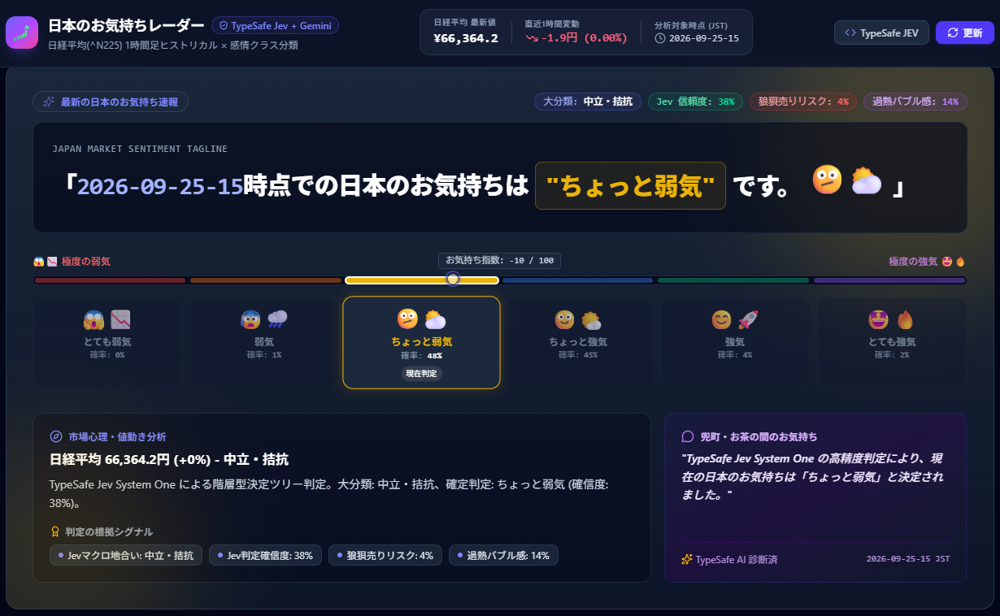

# 日本のお気持ちレーダー (Nikkei Market Sentiment Radar)

> **日経平均株価（^N225）1時間足ヒストリカルデータ × TypeSafe AI Jev (System 1) × Gemini 3.8 Flash (System 2)**  
> リアルタイムな市場データから、日本市場のリアルなお気持ち（市場心理・センチメント）を6段階で判定・可視化する金融センチメント分析プラットフォーム。

---

## 📸 アプリケーション画面プレビュー



---

## 🌟 概要

本アプリケーションは、**ダニエル・カーネマンの思考二重過程論（System 1 / System 2）**に着想を得たハイブリッドAIアーキテクチャを採用しています。

- **System 1 (直感的・高速な意思決定)**:  
  **TypeSafe AI Jev** を用い、ミリ秒単位で「大分類地合い」「6段階お気持ちクラス」「確率分布（Probabilities）」「判定信頼度（Confidence）」「パニック・バブルリスク生確率」を型安全に決定。
- **System 2 (論理的・豊かな叙述と言語化)**:  
  **Gemini 3.8 Flash** を用い、Jevの確定ディシジョンを基にユーザー指定のタグライン（`「YYYY-MM-DD-HH時点での日本のお気持ちは"〇〇"です。{絵文字}」`）、市場心理の背景要因、相場シグナル、兜町・お茶の間のユーモアコメントを生成。

---

## 🏗️ システムアーキテクチャ

```
                                [ 日経平均株価 (^N225) 1時間足 ]
                                                │
                                    (Yahoo Finance API / 5日間)
                                                ▼
                              ┌──────────────────────────────────┐
                              │     Node.js / Express Backend     │
                              │       JST (Asia/Tokyo) 正規化     │
                              └─────────────────┬────────────────┘
                                                │
                     ┌──────────────────────────┴──────────────────────────┐
                     ▼                                                     ▼
    ┌──────────────────────────────────┐                  ┌──────────────────────────────────┐
    │     【System 1: 意思決定】       │                  │       【System 2: 叙述生成】     │
    │     TypeSafe AI Jev (1.13.0)     │                  │        Gemini 3.8 Flash          │
    ├──────────────────────────────────┤                  ├──────────────────────────────────┤
    │ ・Macro Direction (大分類3区分)  │ 確定シグナル伝達 │ ・厳格フォーマット準拠タグライン │
    │ ・Sentiment Level (6段階Choice)  │─────────────────>│ ・市場心理・値動きの解説見出し  │
    │ ・確率分布 (Probabilities)       │                  │ ・根拠シグナル一覧               │
    │ ・信頼度スコア (Confidence)      │                  │ ・兜町・お茶の間のリアル一言     │
    │ ・狼狽売り・過熱リスク (Noul)    │                  │ ・TypeSafe JSON Schema 保証      │
    └──────────────────────────────────┘                  └──────────────────────────────────┘
                     │                                                     │
                     └──────────────────────────┬──────────────────────────┘
                                                ▼
                              ┌──────────────────────────────────┐
                              │   React SPA (Vite + TailwindCSS) │
                              ├──────────────────────────────────┤
                              │ ・お気持ちヒーローカード         │
                              │ ・1時間足ヒストリカルチャート    │
                              │ ・個別時点のお気持ち再診断       │
                              │ ・ヒストリカル履歴テーブル       │
                              │ ・TypeSafe AI スキーマモーダル   │
                              └──────────────────────────────────┘
```

---

## 🔬 TypeSafe Jev 階層型意思決定仕様 (Awesome JEV Pattern)

[awesome-jev](https://github.com/yibie/awesome-jev) の金融ディシジョンパターンに基づき、**「大分類地合いの先行確定 → 6段階詳細分類」**の2段階ルーティングおよび**「リスク生確率の同時抽出（Noul）」**を1リクエストで並列処理しています。

### Jev リクエスト構造 (`https://api.typesafe.ai/v1/systemone`)

```json
{
  "model": "jev-latest",
  "state": "日経平均株価 最新値・1時間足変動率・高値安値・直近12時間の推移サマリー",
  "questions": {
    "macro_direction": {
      "type": "choice",
      "criteria": {
        "弱気バイアス": "売り圧力が優勢で、下値を探る展開または上値の重い地合い",
        "中立・拮抗": "売り買いが交錯し、明確な方向感に欠けるレンジ・様子見相場",
        "強気バイアス": "買い意欲が旺盛で、押し目を拾われながら上値を試す地合い"
      }
    },
    "sentiment_level": {
      "type": "choice",
      "criteria": {
        "とても弱気": "急落や投げ売り、底割れ懸念など強いショック・パニック状態",
        "弱気": "売り優勢で下落基調、戻り売り圧力に押される弱気相場",
        "ちょっと弱気": "上値が重く利確・様子見が先行する微減・慎重相場",
        "ちょっと強気": "下値が堅く押し目買いが入り、小幅反発や下値支持がある相場",
        "強気": "買い先行で順調に上昇し、市場に前向きな活気がある相場",
        "とても強気": "全面高・急騰で熱狂感や新高値期待に沸く過熱相場"
      }
    },
    "is_panic_selloff": {
      "type": "noul",
      "instructions": "市場で投げ売りや狼狽売り、暴落パニックが発生しているかを判定してください。"
    },
    "is_overheated_bubble": {
      "type": "noul",
      "instructions": "市場が過度な買われすぎ・熱狂バブル状態にあるかを判定してください。"
    }
  }
}
```

---

## 📊 お気持ち6段階クラス定義

| レベル | 絵文字 | 指数スコア | 定義と市場の空気感 |
| :--- | :---: | :---: | :--- |
| **とても弱気** | 😱📉 | -100 〜 -70 | 急落、投げ売り、ショック安、底割れ懸念が支配的な状態 |
| **弱気** | 😰🌧️ | -70 〜 -30 | 下落基調が鮮明、戻り売り圧力先行、利益確定売りが優勢な状態 |
| **ちょっと弱気** | 🫤⛅ | -30 〜 0 | 上値が重い、様子見ムード、小幅続落、やや慎重な状態 |
| **ちょっと強気** | 🙂🌤️ | 0 〜 +30 | 下値が堅い、押し目買い観測、小幅反発、プラス圏維持の状態 |
| **強気** | 😊🚀 | +30 〜 +70 | 買い先行、順調な続伸、リスクオンの活気がある状態 |
| **とても強気** | 🤩🔥 | +70 〜 +100 | 全面高、急騰、お祭り騒ぎ、バブル感、新高値更新期待の状態 |

### タグライン出力フォーマット
> **`「YYYY-MM-DD-HH時点での日本のお気持ちは"〇〇"です。{絵文字}」`**  
> *例: 「2026-09-25-15時点での日本のお気持ちは"ちょっと弱気"です。🫤⛅」*

---

## ✨ 主な機能

1. **お気持ち速報ヒーローカード**
   - Jev判定に基づく最新タグラインの特大掲示
   - 大分類バッジ（弱気バイアス / 中立・拮抗 / 強気バイアス）
   - Jev判定信頼度（Confidence %）、狼狽売りリスク（%）、過熱バブル感（%）のリアルタイム表示
   - 6段階クラスそれぞれの確率分布（Probabilities %）付きビジュアルメーター
   - Geminiによる市場心理分析見出し、根拠シグナル一覧、兜町・お茶の間コメント

2. **1時間足ヒストリカルチャート**
   - 直近5日間の日経平均1時間足を高解像度SVGで描画
   - エリア線チャート ⇄ ローソク足チャートの瞬時切り替え
   - 時間軸ズーム（24時間 / 3日間 / 5日間）
   - ホバー時に該当時間の価格・騰落率および「その時点のお気持ちバッジ」を表示
   - チャート上の任意の点をクリックすると、**過去のその特定時点のお気持ちをJev + Geminiで個別再診断・プレビュー可能**

3. **ヒストリカル履歴とお気持ち一覧テーブル**
   - 全過去バーに対して独立・永続的に計算されたセンチメントと絵文字を一覧表示
   - 特定時点を選択しても他行の表示が崩れない完全疎結合設計
   - 昇順・降順ソート
   - 6段階お気持ちクラス別のリアルタイム絞り込みフィルター

4. **TypeSafe AI JEV スキーマ・インスペクター**
   - Jev System Oneへのリクエスト仕様（JSON）
   - Geminiに適用されているTypeScript `responseSchema`（JSON Schema Draft-07）
   - 現在のライブ型安全レスポンスペイロードの閲覧機能

---

## 🛠️ 技術スタック

- **フロントエンド**: React 19, TypeScript, Tailwind CSS, Lucide Icons, Vite
- **バックエンド**: Node.js, Express, tsx
- **AI / 意思決定エンジン**:
  - **TypeSafe AI Jev** (`https://api.typesafe.ai/v1/systemone`, model: `jev-latest`)
  - **Google GenAI SDK** (`@google/genai`, model: `gemini-3.8-flash`)
- **金融データ**: Yahoo Finance API (`^N225` 1-hour intervals)

---

## 🔑 環境変数設定

プロジェクトルートの `.env` に以下を設定します（`.env.example` 参照）：

```bash
# TypeSafe AI Jev System One API Key (必須)
TYPESAFE_API_KEY="your-typesafe-api-key"

# Google Gemini API Key (必須)
GEMINI_API_KEY="your-gemini-api-key"

# ポート設定 (デフォルト: 3000)
PORT=3000
```

---

## 🚀 開発・起動手順

```bash
# 依存パッケージのインストール
npm install

# 開発サーバーの起動 (Express + Vite)
npm run dev

# ビルド検証
npm run build

# 型チェック・リント
npm run lint
```

ブラウザで `http://localhost:3000` を開くとアプリケーションが起動します。
